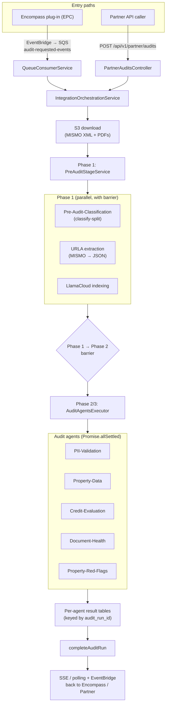

LoanLight is a set of four repositories that together ingest a loan package, run AI agents over it, and deliver a structured audit. This page is the holistic map. For the deeper drill-downs, follow the cross-links into the pipeline, agent, data-model, and ops sections.

## The components

<CardGroup cols={2}>
  <Card title="AUS backend" icon="server">
    `loanlight-api/packages/api` — a NestJS (Fastify) service that orchestrates the audit pipeline, hosts the LangGraph agents, and exposes the Partner API and portal API. Datadog APM service `loanlight-api` (log tag `llapi`).
  </Card>
  <Card title="Lender portal" icon="app-window">
    `loanlight-api/packages/app` — a Next.js 15 App Router stateless Backend-For-Frontend. Lender staff run and review audits and configure rules.
  </Card>
  <Card title="Integrations" icon="plug">
    `loanlight-integrations/packages/encompass` — the live Encompass Partner Connect (EPC) bridge that pushes loan packages to S3 and signals audit requests. Datadog APM service `loanlight-integrations` (log tag `llintegrations`).
  </Card>
  <Card title="Octy" icon="octagon">
    `octy` — the internal self-healing AI command center. Turns reported audit bugs into autonomous Oz-agent investigations.
  </Card>
</CardGroup>

See [repositories](/overview/repositories) for the full package breakdown and [Octy overview](/octy/overview) for the self-healing platform.

## The data stores

- **Postgres (Aurora)** — the system of record. A single Drizzle schema holds `loans`, `lenders`, `audit_runs`, the per-agent result tables, lender config, and the agent platform tables. See [data model overview](/data-model/overview).
- **S3** — raw loan files. EPC loans land in `INTEGRATION_FILES_BUCKET_NAME`; Partner loans land in `PARTNER_S3_BUCKET`. See [S3 layout](/storage/s3-layout).
- **LlamaCloud** — managed document indexing and retrieval. Each loan maps 1:1 to a LlamaCloud pipeline (`loans.llc_pipeline_id`); agents query it with hybrid (dense + sparse + rerank) retrieval. See [LlamaCloud retrieval](/subsystems/llamacloud-retrieval).

## The two observability planes

LoanLight splits observability by concern:

- **LangSmith** is the source of truth for agent reasoning: prompts, model I/O, and node-by-node LangGraph state. Runs are named `${agentType}-Loan-${loanId}` and inputs/outputs are PII-anonymized. Project `loanlight-aus` (int/prod) or `loanlight-studio` (Studio).
- **Datadog** is the source of truth for system behavior around the agents: HTTP traffic, errors, infrastructure, and third-party calls. Every LangGraph node is wrapped in a `langgraph.node` span by central instrumentation.

Note the naming split: Datadog APM service names are `loanlight-api` / `loanlight-integrations`, but Datadog log service tags are `llapi` / `llintegrations`. See [LangSmith](/ops/langsmith) and [Datadog](/ops/datadog).

## How a request becomes an audit

There are three entry paths into the pipeline:

1. **EPC (Encompass Partner Connect)** — the production revenue path. The integrations plug-in pushes the MISMO XML and PDFs to S3 and publishes an EventBridge "Audit Requested" event onto the SQS queue `audit-requested-events`, which the AUS backend drains into `IntegrationOrchestrationService.processAuditRequest`.
2. **Partner API** — a direct REST flow. A lender or LOS calls `POST /api/v1/partner/loans` then `POST /api/v1/partner/audits`.
3. **Legacy LOS-pull (Dev Connect / Encompass REST)** — `POST /api/v1/los/aus` and `/aus/webhook`. Treat this path as deprecated; the Encompass `LosProvider` is now a non-functional stub.

<Note>
Production EPC audit requests arrive over SQS, not an HTTP webhook. The `POST /api/v1/integration-events/process` endpoint exists for internal testing only and is slated for removal.
</Note>

Once a run is created, the orchestrator runs two stages. Phase 1 (`PreAuditStageService`) fans out three parallel branches — classification, URLA preprocessing, and LlamaCloud indexing — and applies a barrier that awaits classification before agents fire. Phase 2/3 (`AuditAgentsExecutor`) runs the audit agents via `Promise.allSettled`. Per-agent failures never fail the run; they are recorded in `audit_errors` and the run still completes. See [end-to-end data flow](/concepts/data-flow) and [pipeline overview](/pipeline/overview).

## The agent platform

The audit agents are catalogued in a DB-backed registry (`agents` plus an `agent_dependencies` DAG), selected by a pure-functional router, and recorded in an additive `agent_runs` ledger. The platform is rolling out in two phases: observer mode (the ledger backfills rows over the existing "run all" fan-out, default in prod) and router ownership (per-lender feature flags, default off and fail-closed). The router does not yet own selection or execution by default; the legacy `AuditAgentsExecutor` still drives execution. See [agent platform overview](/agents/platform-overview) and [router and entitlements](/agents/router-and-entitlements).
